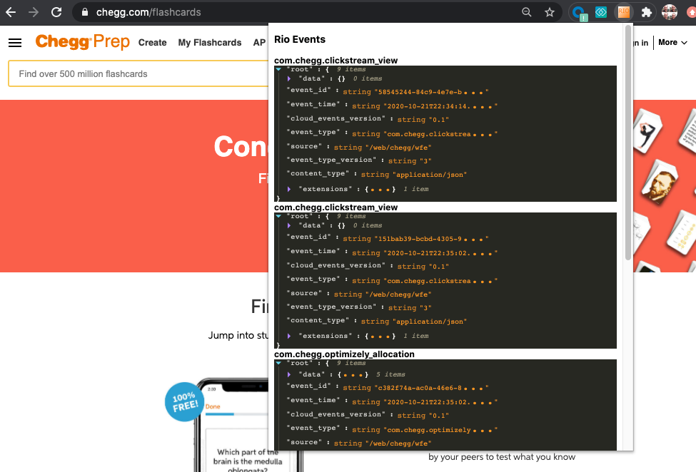

## Rio Chrome Extension

This is a Chrome Extension to display Rio events being sent from the browser.

## Installation

Instructions to come

## Contributors:

Thanks to Gail Flink for a great [Chrome Extension Tutorial](https://medium.com/@gilfink/building-a-chrome-extension-using-react-c5bfe45aaf36) that inspired this project.   Thanks also to my son James Gardner for helping me understand and debug my first ever React App included in this project and introducing me to [Semantic UI](https://react.semantic-ui.com/).